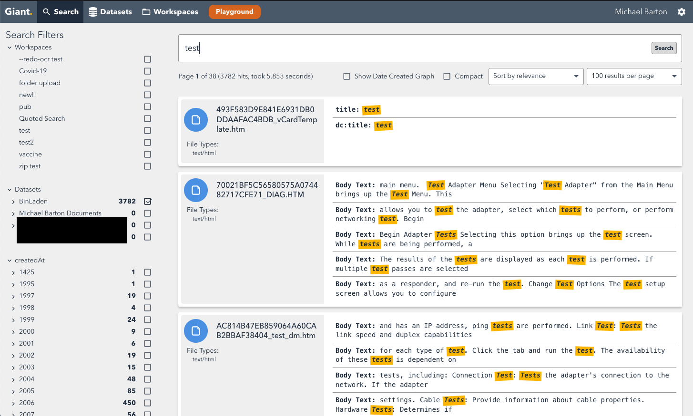
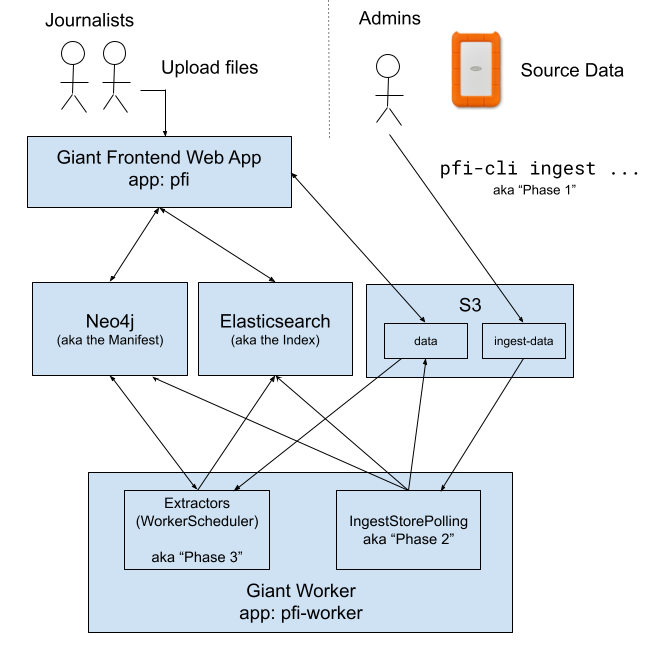

# Giant

Giant makes it easier for journalists to search, analyse, categorise and share unstructured data.
It takes many file formats, indexes them (including converting images to text using OCR) and
provides a UI for search. Users can upload their own files but it also scales up to terabytes
of data. 



Giant is part of the Guardian's "Platform for Investigations" suite, you will see references
to `pfi` in the code. Under development since 2017, it's written in Scala and Typescript and
is maintained by the Investigations & Reporting team.

If Giant doesn't fit your needs, check out [Aleph](https://github.com/alephdata/aleph/) from
the OCCRP and [Datashare](github.com/icij/datashare) from the ICIJ.

## (Users) Getting started

- [Getting started as a normal user](./docs/01-user-quickstart.md)
- [Getting started as an administrator](./docs/02-admin-quickstart.md)

## (Developers) Getting started

Giant has the following pre-requisites for local development:

- [SBT](https://www.scala-sbt.org/)
- [NVM](https://github.com/creationix/nvm)
- [Docker](https://www.docker.com/)

Giant uses three databases, run locally in Docker through [docker-compose.yaml](./docker-compose.yml):

- [neo4j](https://neo4j.com/)
- [Elasticsearch](https://www.elastic.co/elasticsearch/)
- [minio](https://min.io/) (for S3 compatibility)

There are two optional dependencies:

- [Tesseract](https://github.com/tesseract-ocr/tesseract)
  - To extract text from images (OCR).
  - `brew install tesseract`
- [Libre Office](https://www.libreoffice.org/)
  - To convert and preview Microsoft Office documents in the UI

Elasticsearch requires Docker to have at least 4GB of memory from the preferences menu otherwise
it will exit with no log output and error 137.

*For Guardian developers*:

- Janus credentials are not required to run Giant locally.
- The [Giant Runbook](https://docs.google.com/document/d/12gInBe7e79vathKXdv6DSJ3QmtDL-zAH5R0_Lwn6bJQ)

Select the correct version of node:

```
nvm use
```

Then run the setup script:

```
./scripts/setup.sh
```

Seed the configuration:

```
./scripts/cluster-setup.sh
```

Run the Scala backend:

```
./scripts/start-backend.sh
```

This will also automatically launch the databases in the background by running
`docker-compose up -d`. 

In a separate terminal, run the [Create React App](https://github.com/facebook/create-react-app)
frontend:

```
./scripts/start-frontend.sh
```

The frontend script will wait for the backend to start before launching Giant at
`http://localhost:3000`.

Once Giant has started, follow the [admin quickstart guide](./docs/02-admin-quickstart.md).

### dev-nginx proxy

You can use [dev-nginx](https://github.com/guardian/dev-nginx) to more easily access Giant
and the backing databases whilst running locally.

```
dev-nginx setup-app util/nginx-mapping.yml
```

- Giant: https://pfi.local.dev-gutools.co.uk/
- neo4j: https://neo4j.pfi.local.dev-gutools.co.uk/
    - Enter `bob` as the password when prompted
- Elasticsearch: https://elasticsearch.pfi.local.dev-gutools.co.uk/
- Cerebro (to manage Elasticsearch): https://cerebro.pfi.local.dev-gutools.co.uk/
- Minio: https://minio.pfi.local.dev-gutools.co.uk/
    - Username: `minio-user`
    - Password: `reallyverysecret`

### Running Tests

To run all unit tests:

```
sbt test
```

To run all integration tests:

```
sbt int:test
```

To run a specific integration test:

```
sbt 'int:testOnly controllers.api.WorkspacesITest'
```

### Stopping databases

To terminate the databases without losing data:

```
docker-compose down
```

To terminate and delete data:

```
docker-compose down -v
```

## Contributing

The Guardian welcomes contributions to Giant. We do not yet have a publicly accessible CI
server but please ensure all tests pass by running the build script locally:

```
./scripts/teamcity.sh
```

We do not yet publish deployment templates for Giant in either cloud hosts or locally. If you
are interested in deploying Giant please get in touch by raising a GitHub issue on this repository.

## Architecture



https://docs.google.com/drawings/d/1wcTY9KLhkYqxmwzsyZ3DsWcc0v-ax5kMKWtYb4HZgF0

## Licensing

Giant uses the Apache 2.0 licence. Some libraries used are licensed separately:

- [unRAR License](https://github.com/junrar/junrar/blob/c9969c898ebf34e3710f96395d049762c2bff5b8/LICENSE#L13)
- [JPEG2000 - JJ2000 License](https://github.com/jai-imageio/jai-imageio-jpeg2000/blob/master/LICENSE-JJ2000.txt)

## Supported file formats

- `.rar` archives (v4 and below)
- `.zip` archives
- `.eml` [RFC 5322](https://www.loc.gov/preservation/digital/formats/fdd/fdd000388.shtml) emails
- `.mbox` email archives
- `.msg` Outlook email files
- `.pst` Outlook email archives
- `.olm` Outlook for Mac email archives/backups
- `.png`, `.jpg`, `.tiff` images (including OCR)
- `.pdf` (including OCR)
- Microsoft Office Word, Excel and Powerpoint files
- Various plain text files (see [DocumentBodyExtractor](./backend/app/extraction/DocumentBodyExtractor.scala))

## Experimental features

Experimental features are enabled through feature flags in the Settings page:

- *New UI*: a simplified UI implemented using the [Elastic UI](https://elastic.github.io/eui/) toolkit
- *Page Viewer*: a unified document viewer showing text, OCR and search highlights inline on the original document

## Credits

In addition to any contributors named in this repository, the following contributed to Giant
whilst it was closed source at the Guardian:

- [Michael Barton](https://github.com/mbarton)
- [Joseph Smith](https://github.com/joelochlann)
- [Sam Cutler](https://github.com/itsibitzi)
- [Simon Hildrew](https://github.com/sihil)
- [Reetta Vaahtoranta](https://github.com/Reettaphant)
- [Shaun Dillon](https://github.com/shaundillon)
- [Christopher Lloyd](https://github.com/clloyd)
- [Amy Hughes](https://github.com/amyhughes)
- [Max Duval](https://github.com/mxdvl)
- [Mateusz](https://github.com/paperboyo)