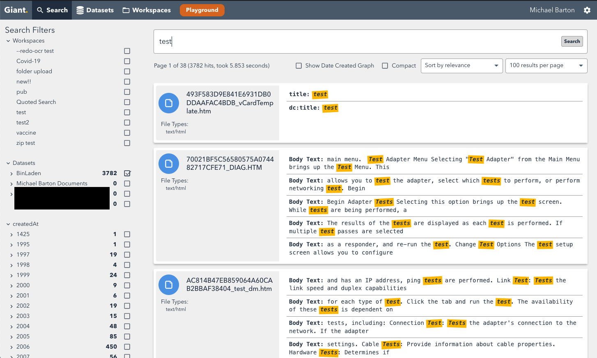
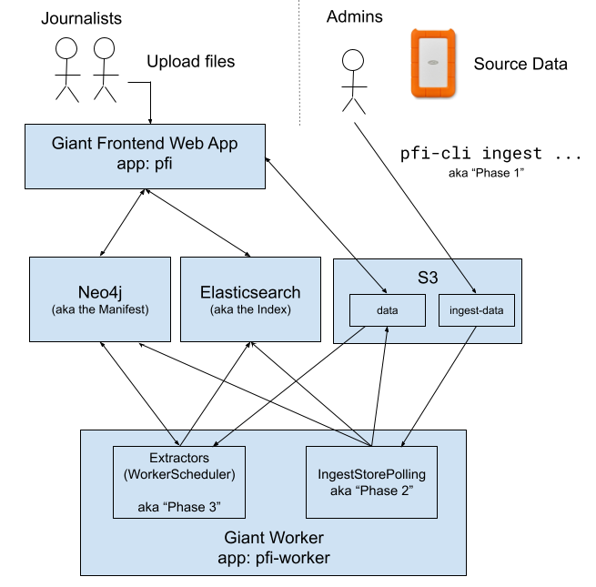

# Giant

Giant makes it easier for journalists to search, analyse, categorise and share unstructured data.
It takes many file formats, indexes them (including converting images to text using OCR) and
provides a UI for search. Users can upload their own files but it also scales up to terabytes
of data.



Giant is part of the Guardian's "Platform for Investigations" suite, you will see references
to `pfi` in the code. Under development since 2017, it's written in Scala and Typescript and
is maintained by the Investigations & Reporting team.

If Giant doesn't fit your needs, check out [Aleph](https://github.com/alephdata/aleph/) from
the OCCRP and [Datashare](https://github.com/icij/datashare) from the ICIJ.

## (Users) Getting started

- [Getting started as a normal user](./docs/01-user-quickstart.md)
- [Getting started as an administrator](./docs/02-admin-quickstart.md)

## (Developers) Getting started - running on your local machine

Giant has the following pre-requisites for local development:

- [SBT](https://www.scala-sbt.org/)
- [Mise](https://mise.jdx.dev/installing-mise.html) or your choice of nodejs/java/sbt version manager
- [Docker](https://www.docker.com/)


Giant uses three databases, run locally in Docker through [docker-compose.yaml](./docker-compose.yml). For local running it also uses
garage as an object storage:

- [neo4j](https://neo4j.com/)
- [Elasticsearch](https://www.elastic.co/elasticsearch/)
- [PostgresSQL](https://www.postgresql.org/)
- [Garage](https://garagehq.deuxfleurs.fr/)

There are various optional dependencies needed to support extraction of different file types - you can see what these 
are in the Brewfile or setup.sh script

Elasticsearch requires Docker to have at least 4GB of memory from the preferences menu otherwise
it will exit with no log output and error 137.

*For Guardian developers*:

- Janus credentials are not required to run Giant locally.
- The [Giant Runbook](https://docs.google.com/document/d/12gInBe7e79vathKXdv6DSJ3QmtDL-zAH5R0_Lwn6bJQ)

Install nodejs, scala, jvm - here we use mise:

```
mise install
```

Then run the setup script:

```
./scripts/setup.sh
```

Run the Scala backend:

```
./scripts/start-backend.sh
```

This will also automatically launch the databases in the background by running
`docker-compose up -d`.

In a separate terminal, run the [Create React App](https://github.com/facebook/create-react-app)
frontend:

```
./scripts/start-frontend.sh
```

The frontend script will wait for the backend to start before launching Giant at
`http://localhost:3000`.

Once Giant has started, follow the [admin quickstart guide](./docs/02-admin-quickstart.md).

## (Developers) Getting started - running in a dev container
We have started using [dev containers](https://containers.dev/) to isolate dev environments from the host machine.

Giant makes use of https://github.com/guardian/devenv to simplify the dev container configuration - this will be installed
by `mise` if you have that, otherwise you'll need to install it manually. There's some documentation on using dev containers
in the [.devcontainer README file](./.devcontainer/README.md), in the guardian/devenv repo and here https://containers.dev/.

To use the checked in devcontainer version to run giant, open Giant up in your ide of ch

To run giant inside a dev container, first it's worth generating your local devenv configuration, in case you have
customised it at all:

`devenv generate`

Next, open up .devcontainer/user/devcontainer.json in either VS Code or IntelliJ (Note: dev container support in IntelliJ
improve significantly in summer 2026, so make sure you have the latest version.)

Your IDE might have some shortcut but the long way round is to right click on the user config file, go to 'dev containers'
and then either 'Create dev container and mount sources' or 'Create dev container and clone sources'. 

In general, the best practice is to 'create dev container and clone sources' so that the dev container is isolated from 
your machine as much as possible. However, in instances where you are jumping back and forth a lot between your local
machine and the dev container, you may prefer to mount sources instead, so changes are synced instantly rather than
having to go via github.

A new IDE window will eventually open. You'll then need to setup giant within the dev container (should be a one off).
You can either use the IDE terminal for this or, get the name of the container from your Docker desktop or your IDE and run:

`docker exec -it container_name zsh` to open a shell inside the container. The giant project will be at `/IdeaProjects/giant`.

Once you have a terminal in the dev container, mise install should have already happened so you can run setup.sh straight
away:

`./scripts/setup.sh`

and then use the start-backend/frontend scripts as described above. Note that in devenv.yaml we can add port forwarding
for the bits of giant we need to access on the local machine. If you change these port numbers you'll need run
`devenv generate` and then restart your container - best way to do this is to close the devcontainer IDE window and then 
reopen it using the local machine IDE.

### dev-nginx proxy

You can use [dev-nginx](https://github.com/guardian/dev-nginx) to more easily access Giant
and the backing databases whilst running locally.

```
dev-nginx setup-app util/nginx-mapping.yml
```

- Giant: https://pfi.local.dev-gutools.co.uk/
- neo4j: https://neo4j.pfi.local.dev-gutools.co.uk/
    - Enter `bob` as the password when prompted
- Elasticsearch: https://elasticsearch.pfi.local.dev-gutools.co.uk/
- Cerebro (to manage Elasticsearch): https://cerebro.pfi.local.dev-gutools.co.uk/
- Garage: https://garage.pfi.local.dev-gutools.co.uk/
    - Username: `garage-user`
    - Password: `reallyverysecret`

### Running Tests

To run all unit tests:

```
sbt test
```

To run all integration tests:

```
sbt int:test
```

To run a specific integration test:

```
sbt 'int:testOnly controllers.api.WorkspacesITest'
```

### Stopping databases

To terminate the databases without losing data:

```
docker-compose down
```

To terminate and delete data:

```
docker-compose down -v
```

## Contributing

The Guardian welcomes contributions to Giant. We do not yet have a publicly accessible CI
server but please ensure all tests pass by running the build script locally:

```
./scripts/teamcity.sh
```

We do not yet publish deployment templates for Giant in either cloud hosts or locally. If you
are interested in deploying Giant please get in touch by raising a GitHub issue on this repository.

## Architecture



https://docs.google.com/drawings/d/1wcTY9KLhkYqxmwzsyZ3DsWcc0v-ax5kMKWtYb4HZgF0

## Licensing

Giant uses the Apache 2.0 licence. Some libraries used are licensed separately:

- [unRAR License](https://github.com/junrar/junrar/blob/c9969c898ebf34e3710f96395d049762c2bff5b8/LICENSE#L13)
- [JPEG2000 - JJ2000 License](https://github.com/jai-imageio/jai-imageio-jpeg2000/blob/master/LICENSE-JJ2000.txt)

## Supported file formats

- `.rar` archives (v4 and below)
- `.zip` archives
- `.eml` [RFC 5322](https://www.loc.gov/preservation/digital/formats/fdd/fdd000388.shtml) emails
- `.mbox` email archives
- `.msg` Outlook email files
- `.pst` Outlook email archives
- `.olm` Outlook for Mac email archives/backups
- `.png`, `.jpg`, `.tiff` images (including OCR)
- `.pdf` (including OCR)
- Microsoft Office Word, Excel and Powerpoint files
- Various plain text files (see
  [DocumentBodyExtractor](./backend/app/extraction/DocumentBodyExtractor.scala))
- Audio files
  - fully supported
    - `.wav`
    - `.mpeg`
    - `.opus`
    - `.caf`
    - `.mp4`
    - `.aac` (tika sometimes has trouble detecting these)
  - transcribed but preview doesn't work
    - `.aff`
    - `.amr`
    - `.wma`
- Video files
  - fully supported
    - `.mov`, `.qt`
    - `.m4v`
    - `.3gpp`
    - `.mp4`
  - transcribed but preview doesn't work
    - `.flv`
    - `.wmv`
    - `.msvideo`
    - `.mpeg`

## Experimental features

Experimental features are enabled through feature flags in the Settings page:

- *New UI*: a simplified UI implemented using the [Elastic UI](https://elastic.github.io/eui/) toolkit
- *Page Viewer*: a unified document viewer showing text, OCR and search highlights inline on the original document

## Credits

In addition to any contributors named in this repository, the following contributed to Giant
whilst it was closed source at the Guardian:

- [Michael Barton](https://github.com/mbarton)
- [Joseph Smith](https://github.com/joelochlann)
- [Sam Cutler](https://github.com/itsibitzi)
- [Simon Hildrew](https://github.com/sihil)
- [Reetta Vaahtoranta](https://github.com/Reettaphant)
- [Shaun Dillon](https://github.com/shaundillon)
- [Christopher Lloyd](https://github.com/clloyd)
- [Amy Hughes](https://github.com/amyhughes)
- [Max Duval](https://github.com/mxdvl)
- [Mateusz](https://github.com/paperboyo)
- [Maria Livia Chiorean](https://github.com/marialivia16)
- [Marjan Kalanki](https://github.com/marjisound)
- [Philip McMahon](https://github.com/philmcmahon)
- [Zeke Hunter-Green](https://github.com/zekehuntergreen)
