# Getting started with Giant

## Uploading documents

Workspaces are where you upload and organise your files in Giant. To begin you upload your files to a workspace and you can then browse and search through them. Files in a workspace are private to you by default - however you can share access with others within the Guardian.

Click "Workspaces" on the top navigation bar:

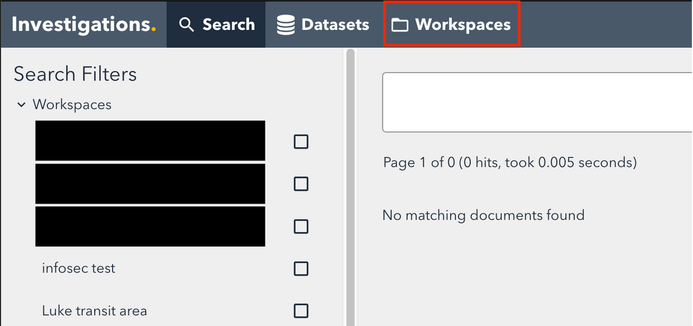

Then click “New Workspace”:

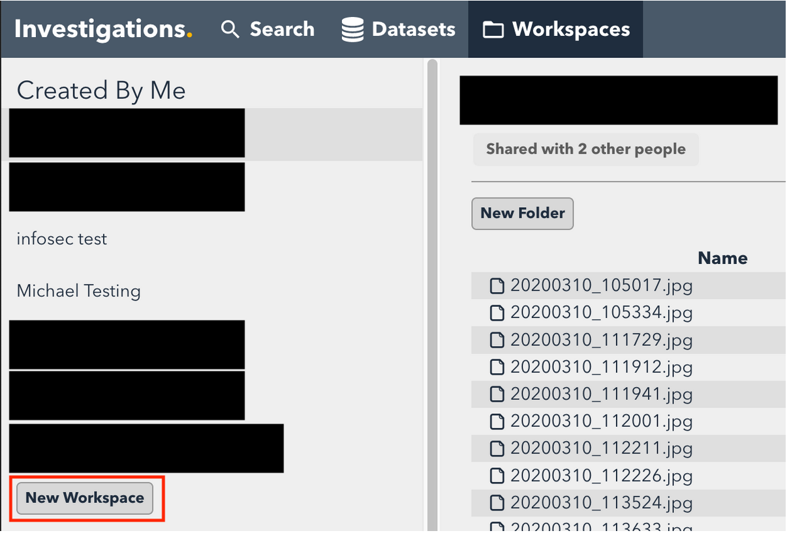

Click “Upload to Workspace”:

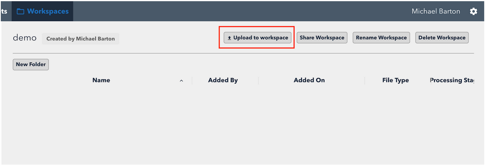

Select the files or directory from your computer you want to upload. If you add a directory, its structure will be preserved in the workspace:

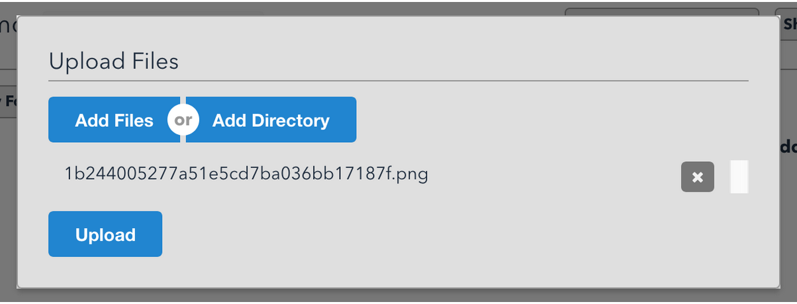

Once uploaded, the files will appear in the workspace. The spinning icon indicates that Giant is processing the files. For some tasks, like OCR, this will depend on how big the file is (for example how many pages it has). You can safely navigate away from the page though and come back once they are done.

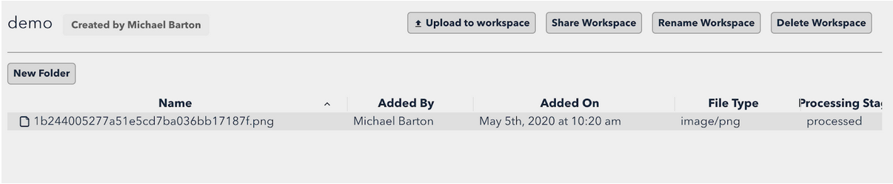

Double click the files to view:

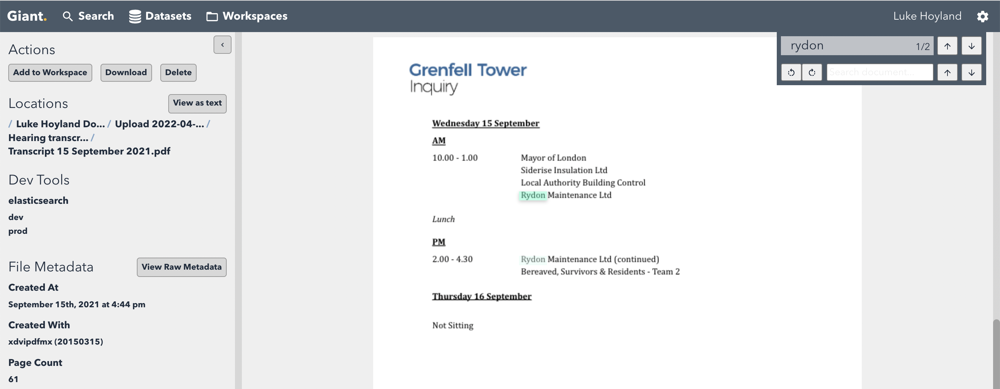

If you came to the file from search, the first hit will be highlighted. You can also search within the document using the in-document search field.

## Searching documents in a workspace

Click “Search” in the header:

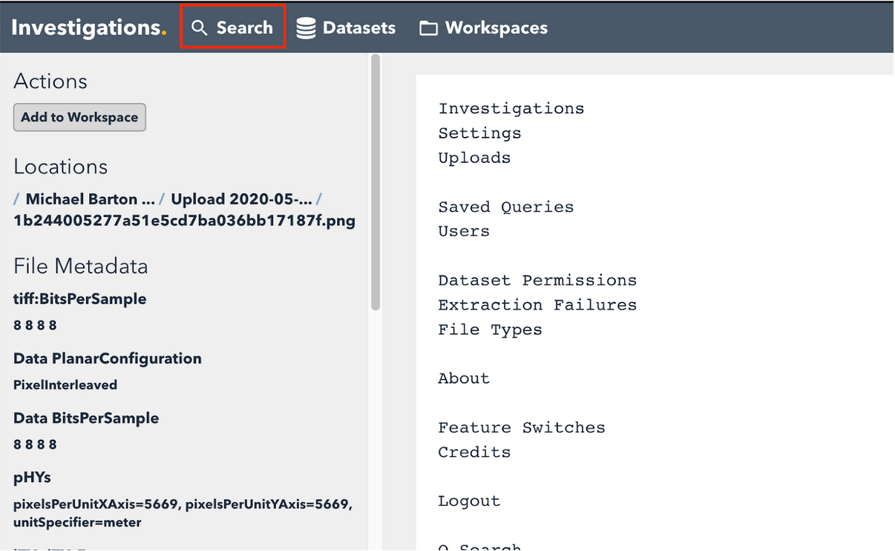

Enter your search term in the box. To restrict your search to just the documents in a particular workspace, click the checkbox next to that workspace's name, on the left:

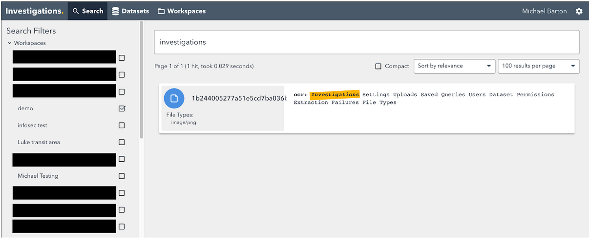

## Sharing access to documents using a workspace

Documents uploaded to a workspace you create are **private to you by default**. To share access with others, click “Share Workspace” when viewing the workspace:

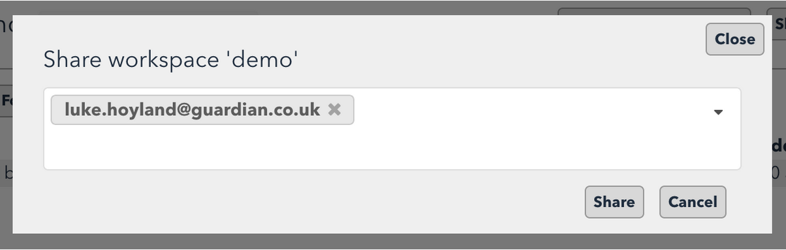

Add the email addresses of who you want to have access. These people will be able to **view and edit anything in the workspace**: they can add files, rename them, move them and remove them. These people will **not be able to delete the workspace, rename it, or share it with more people**.

You can remove people by clicking the ‘X’ next to their email. If you remove everyone only you will have access.

Note this applies to all of the documents in a workspace. To share just some files, create a new workspace and add them.

## Organising files in workspaces

To create a folder click the New Folder button:

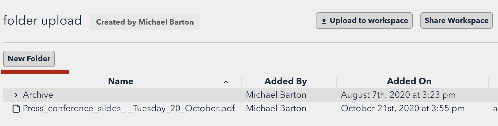

To move files just drag as in Finder (shift-click and cmd-click will work for multiple selections just as in Finder):

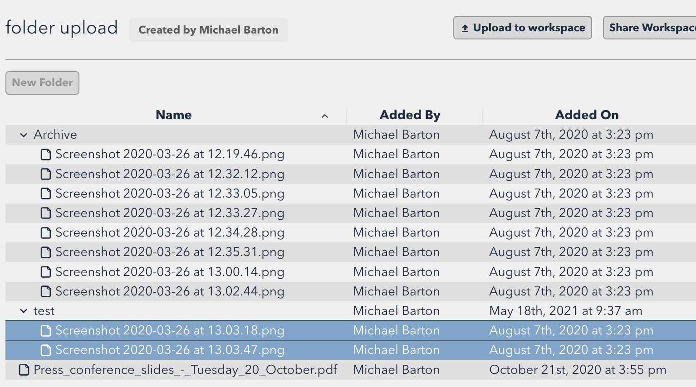

To rename a file or remove a file, right-click on it:

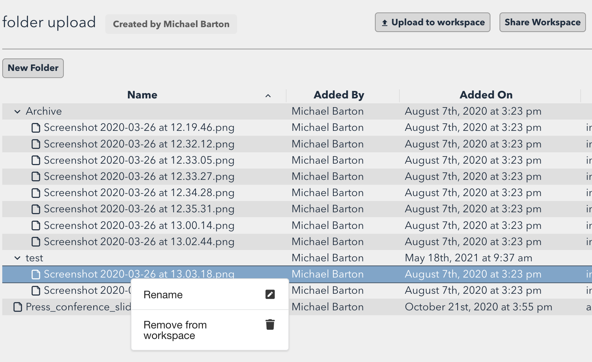

When removing a file from a workspace, the file is only removed from that workspace and remains in Giant as well as in any other workspaces it has been added to. To permanently delete something from Giant, please contact your administrator.
