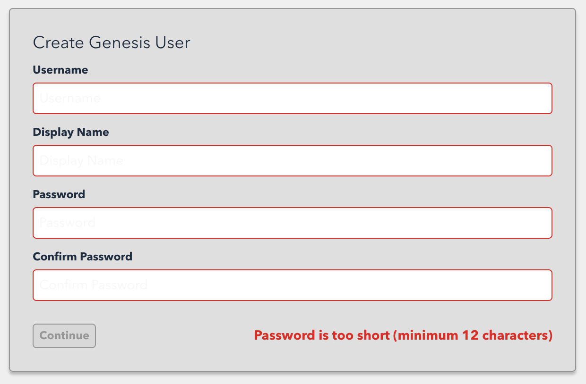
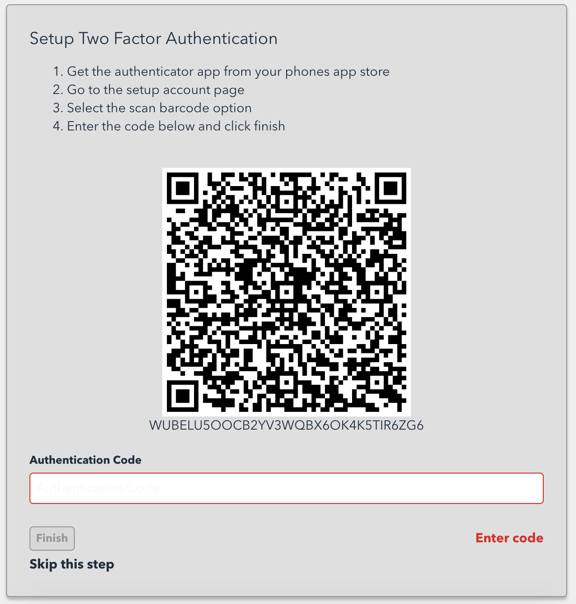
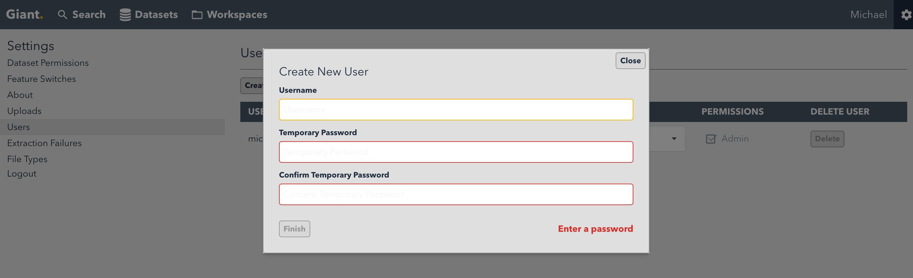
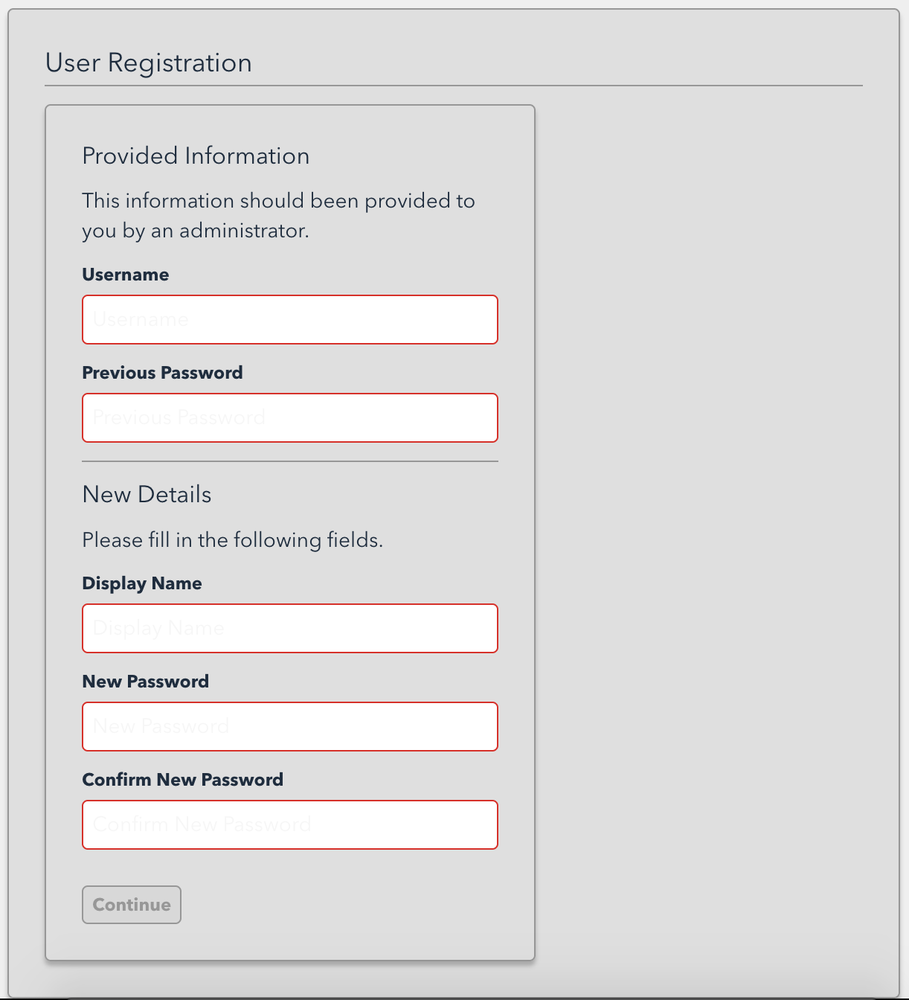
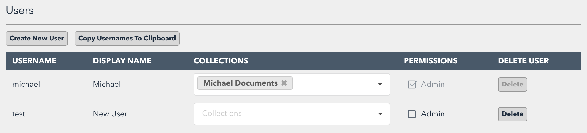

# Getting started as a Giant administrator

## Creating the initial admin (genesis) user

When first run, Giant will redirect you to an interactive page to create the initial administrator user, known as the genesis user:



For convenience during development, TOTP two factor authentication is optional (see Skip this Step below):



However it must be enabled in any deployment for security. To require TOTP, edit `application.conf`:

```
auth {
  database {
    require2FA = true
  }
}
```

You can then create additional users from the settings page:



They will then need to register using the temporary password by visiting the `/register` UI:



## User management

As an administrator, you can control which datasets each user can see in the Settings page:



You can make other users administrators by ticking the "Admin" checkbox.

Giant will automatically create a "Documents" dataset for each user which is used for direct uploads to workspaces.

Administrators can see a summary of all files uploaded to workspaces in the Uploads tab on the Settings page.

## Uploading large amounts of data using the CLI

Small numbers of files are best uploaded to Giant by creating a workspace and uploading through
the web UI. Uploading larger amounts of data is done using the PFI command line,
[pfi-cli](../cli).

Uploads are grouped under collections (labelled Datasets in the UI), with multiple ingestions
within each collection. A collection represents a single logical dataset to the user, with an
ingestion representing each upload of data to that dataset. The collection name should describe
the data in a meaningful way to users with each ingestion name meaningful to administrators and
devleopers, probably including a description of the source media itself and when the ingestion
was performed.

First create an ingestion. The collection will be created automatically if it doesn't exist yet:

```
pfi-cli create-ingestion \
  --ingestionUri <collection_name>/<ingestion_name> \
  --languages <comma_separated_languages eg english,russian>
```

Then run the upload:

```
pfi-cli ingest \
  --ingestionUri <collection_name>/<ingestion_name> \
  --path <path to the data on disk>
  --languages <comma_separated_languages eg english,russian> \
  --minioAccessKey <see application.conf> \
  --minioSecretKey <see application.conf>
```
